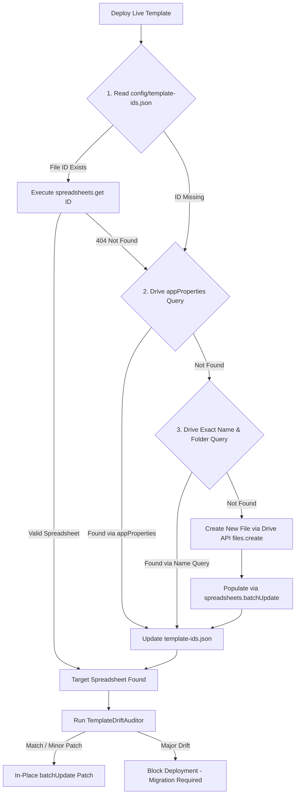

# Research: Google Sheets API v4 Batching & Idempotent Template Provisioning

**Issue**: #126  
**Status**: Completed  
**Author**: Research Agent  
**Date**: August 2026  

---

## Executive Summary

When programmatically provisioning and patching Google Sheets `DocumentLogWorkbook` templates in CI/CD environments or host tooling (`npm run template:deploy-live`), execution scripts must observe Google’s API quota limits while preventing duplicate template creation across concurrent deployments.

### Key Research Findings

1. **API Rate Quotas & Efficiency**:
   - **Google Sheets API v4 Rate Limit**: 60 requests per minute per user per project, and 300 requests per minute per project across all users.
   - **Batching Quota Accounting**: A single `spreadsheets.batchUpdate` HTTP POST request counts as **1 single API call** against quota limits, regardless of how many individual operation sub-requests (e.g. 50+ tab creations, Named Ranges, formatting rules, data validations) are bundled inside its payload.
   - **Exponential Backoff with Full Jitter**: Transient `429 Too Many Requests` or `503 Service Unavailable` errors must be handled using Full Jitter (`sleep = random(0, min(cap, base * 2^attempt))`) to prevent synchronized retry spikes ("thundering herd" effect).

2. **2-Call Workbook Provisioning Architecture**:
   - Instead of issuing dozens of sequential API calls, an entire `DocumentLogWorkbook` template creation can be bundled into **2 HTTP requests**:
     - **Call 1**: `Drive API v3 files.create` to allocate the file, set title, parent folder, and tag custom application metadata (`appProperties`).
     - **Call 2**: `Sheets API v4 spreadsheets.batchUpdate` containing an array of sub-requests (`addSheet`, `updateCells`, `addNamedRange`, `setDataValidation`, `addProtectedRange`, `updateDimensionProperties`, `repeatCell`).
   - Formula updates and initial configuration seed rows can optionally use `spreadsheets.values.batchUpdate` with `valueInputOption="USER_ENTERED"`.

3. **Idempotency & Duplicate Prevention**:
   - **3-Tier Lookup Cascade**: Primary lookup in `config/template-ids.json` $\rightarrow$ Drive API `appProperties` metadata search (`appProperties has { key='templateType' and value='DocumentLogWorkbook_Test' }`) $\rightarrow$ Drive API file name + folder search fallback (`name = '...' and '<folderId>' in parents and trashed = false`).
   - **In-place Patching**: If an existing template is found, update structure/schema in-place using a single `batchUpdate` call (preserving file ID and existing sheet references).
   - **Race Condition Tie-Breaker**: To prevent concurrent CI runners from creating duplicate files simultaneously, files are tagged with a unique `provisioningId` (UUID) in `appProperties` at creation. Post-creation verification checks `files.list` sorted by `createdTime asc`; non-oldest duplicate creations are automatically trashed and re-bound to the oldest file.

---

## 1. Google API Quota & Rate Limits

### 1.1 Quota Specifications

Google APIs enforce rate limits per project and per user to ensure infrastructure stability.

| API | Per-User Rate Limit | Per-Project Total Limit | Quota Accounting Unit |
| :--- | :--- | :--- | :--- |
| **Google Sheets API v4** | **60 requests / minute / user** | 300 requests / minute | 1 HTTP Request = 1 Quota Unit |
| **Google Drive API v3** | **1,200 requests / 100 seconds** (~12 req/sec) | 12,000 requests / 100 seconds (~120 req/sec) | 1 HTTP Request = 1 Quota Unit |

> [!IMPORTANT]
> Rate limits apply equally to read requests (`spreadsheets.get`, `files.list`) and write requests (`spreadsheets.batchUpdate`, `values.batchUpdate`, `files.create`). Exceeding quotas results in HTTP status code `429 Too Many Requests`.

### 1.2 Transient Error Handling & Retry Strategy

When calling Google APIs from Node.js deployment tools, network glitches or quota caps trigger `429 Too Many Requests` or `503 Service Unavailable` errors.

#### Why Full Jitter is Required

Standard exponential backoff ($T = \text{base} \times 2^{\text{attempt}}$) causes synchronized retry bursts when multiple CI workers or users encounter rate limits at the same moment. **Full Jitter** randomizes the sleep interval evenly between 0 and the exponential cap:

$$\text{Sleep Time} = \text{random}\Big(0, \min\big(\text{cap}, \text{base} \times 2^{\text{attempt}}\big)\Big)$$

Where:
- $\text{base} = 1000\text{ ms}$ (1 second)
- $\text{cap} = 32000\text{ ms}$ (32 seconds)
- $\text{maxRetries} = 5$

```typescript
/**
 * Tier 3 Utility: Execute HTTP / Google API requests with Exponential Backoff + Full Jitter.
 */
export async function executeWithRetry<T>(
  operation: () => Promise<T>,
  maxRetries: number = 5,
  baseDelayMs: number = 1000,
  maxDelayMs: number = 32000
): Promise<T> {
  let attempt = 0;

  while (true) {
    try {
      return await operation();
    } catch (error: any) {
      attempt++;
      const statusCode = error?.status || error?.response?.status || error?.code;
      const isRetryable = statusCode === 429 || statusCode === 500 || statusCode === 502 || statusCode === 503 || statusCode === 504;

      if (!isRetryable || attempt > maxRetries) {
        throw error;
      }

      // Respect Retry-After header if provided by Google API response
      const retryAfterHeader = error?.response?.headers?.['retry-after'];
      let delayMs: number;

      if (retryAfterHeader && !isNaN(Number(retryAfterHeader))) {
        delayMs = Number(retryAfterHeader) * 1000;
      } else {
        // Calculate Exponential Backoff with Full Jitter
        const exponentialBound = Math.min(maxDelayMs, baseDelayMs * Math.pow(2, attempt - 1));
        delayMs = Math.floor(Math.random() * exponentialBound);
      }

      console.warn(`[API Retry] HTTP ${statusCode} encountered. Retrying attempt ${attempt}/${maxRetries} after ${delayMs}ms jittered delay...`);
      await new Promise((resolve) => setTimeout(resolve, delayMs));
    }
  }
}
```

---

## 2. Single-Call / Multi-Request Batching (`spreadsheets.batchUpdate`)

### 2.1 API Endpoint Capabilities & Payload Schemas

Google Sheets API v4 provides transactional multi-operation batching via the endpoint:
`POST https://sheets.googleapis.com/v4/spreadsheets/{spreadsheetId}:batchUpdate`

#### Transactional Atomicity
All operations in the `requests` array are executed in a single atomic transaction. If **any** sub-request in the array fails validation (e.g. invalid Named Range scope or non-existent tab ID), the entire batch fails and **zero changes are committed** to the Google Sheet.

#### Supported Sub-Request Types for Workbook Schema Provisioning

| Sub-Request Name | Primary Purpose in `DocumentLogWorkbookSpec` |
| :--- | :--- |
| `addSheet` | Create required workbook tabs (`_Config`, `_Shared`, `Submittal Arch`, `Submittal FFE`, support tabs). |
| `updateSheetProperties` | Configure grid sizes (e.g. freeze row count, tab color, hidden state). |
| `updateCells` | Populate header row text, baseline cells, and grid styles in a single grid range payload. |
| `addNamedRange` / `updateNamedRange` | Define schema Named Ranges (`MANIFEST_SCHEMA_VERSION`, `Config_Manifest`, `Config_<DocTypeKey>`, `<TabName>_Headers`, `<TabName>_FormulaRow`). |
| `setDataValidation` | Bind cell ranges to dropdown list formulas referencing `_Config` and `_Shared` tabs. |
| `addProtectedRange` | Lock `FormulaRow` and Header rows to prevent accidental end-user edits. |
| `updateDimensionProperties` | Set exact pixel widths for log columns. |
| `repeatCell` | Mass-apply typography, background fills, text wrapping, and borders across tab ranges. |

### 2.2 Data Row & Formula Batching (`values.batchUpdate`)

To update non-contiguous range values, formula calculations, or seed rows across multiple tabs, use:
`POST https://sheets.googleapis.com/v4/spreadsheets/{spreadsheetId}/values:batchUpdate`

```json
{
  "valueInputOption": "USER_ENTERED",
  "data": [
    {
      "range": "_Config!A1:B2",
      "majorDimension": "ROWS",
      "values": [
        ["Key", "Value"],
        ["MANIFEST_SCHEMA_VERSION", "1.0.0"]
      ]
    },
    {
      "range": "'Submittal Arch'!A4:Z4",
      "majorDimension": "ROWS",
      "values": [
        ["=MAP(A5:A, LAMBDA(x, IF(ISBLANK(x), \"\", ROW(x)-4)))", "", ""]
      ]
    }
  ]
}
```

> [!NOTE]
> `valueInputOption="USER_ENTERED"` is mandatory so strings starting with `=` (such as `=MAP(...)`) are parsed and compiled as active dynamic formulas in Google Sheets rather than literal text strings.

### 2.3 Bundling Provisioning into 2 API Calls

Sequential creation vs. Batched creation performance comparison for provisioning a full multi-tab workbook:

```
Sequential Provisioning (Anti-Pattern): ~45 API Requests
├── 1. Drive.create (File)
├── 2-7. Sheets.addSheet (x6 tabs)
├── 8-13. Values.update Headers (x6 tabs)
├── 14-25. Sheets.addNamedRange (x12 ranges)
├── 26-37. Sheets.setDataValidation (x12 ranges)
└── 38-45. Sheets.addProtectedRange (x8 ranges)
Result: Hits 60 req/min user limit almost immediately!

Batched Provisioning (Recommended): 2 API Requests
├── Call 1: Drive API files.create (File allocation + Folder placement + Metadata appProperties)
└── Call 2: Sheets API spreadsheets.batchUpdate (All tabs + Headers + Named Ranges + Validations + Protections + Formatting)
Result: 2 API calls total. 0 risk of quota exhaustion!
```

#### TypeScript Composite Payload Builder Pattern

```typescript
export function buildDocumentLogWorkbookBatchRequest(spec: DocumentLogWorkbookSpec): any[] {
  const requests: any[] = [];

  // 1. Add all required tabs defined in spec
  for (const tab of spec.tabs) {
    requests.push({
      addSheet: {
        properties: {
          title: tab.name,
          gridProperties: { rowCount: tab.rowCount, columnCount: tab.columnCount }
        }
      }
    });
  }

  // 2. Add Named Ranges
  for (const range of spec.namedRanges) {
    requests.push({
      addNamedRange: {
        namedRange: {
          name: range.name,
          range: range.gridRange
        }
      }
    });
  }

  // 3. Set Data Validations & Cell Protections
  for (const protection of spec.protectedRanges) {
    requests.push({
      addProtectedRange: {
        protectedRange: {
          range: protection.gridRange,
          description: protection.description,
          warningOnly: false
        }
      }
    });
  }

  return requests;
}
```

---

## 3. Idempotent File Provisioning & Duplication Prevention

### 3.1 Google Drive API v3 Search Query Syntax

To check for existing template files before provisioning, query Google Drive API v3:
`GET https://www.googleapis.com/drive/v3/files?q=...`

#### Precise Query String Formats

Finding template by exact name, parent folder, and MIME type:
```http
q="name = 'DocumentLogWorkbook_Template_Test' and '1a2b3c4d5e6f' in parents and trashed = false and mimeType = 'application/vnd.google-apps.spreadsheet'"
```

Finding template by immutable custom application metadata (`appProperties`):
```http
q="appProperties has { key='templateType' and value='DocumentLogWorkbook_Test' } and trashed = false"
```

> [!WARNING]
> Searching by file `name` alone is susceptible to user renames or manual folder moves. Searching via `appProperties` is private to the application client ID and remains robust even if end-users rename the Google Sheet in the UI.

### 3.2 3-Tier Idempotent Lookup Hierarchy



### 3.3 Atomic Duplication Prevention & Concurrent CI Race Conditions

When multiple CI runners execute `npm run template:deploy-live` simultaneously, both may perform a `files.list` search, receive "Not Found", and simultaneously call `files.create`, producing duplicate files in Google Drive.

#### Double-Check Verification & Tie-Breaker Protocol

1. **Tag File at Creation**:
   When invoking Drive API `files.create`, pass custom `appProperties`:
   ```json
   {
     "name": "DocumentLogWorkbook_Template_Test",
     "mimeType": "application/vnd.google-apps.spreadsheet",
     "parents": ["<folderId>"],
     "appProperties": {
       "templateType": "DocumentLogWorkbook_Test",
       "provisioningId": "uuid-v4-instance-id"
     }
   }
   ```

2. **Post-Creation Race Condition Audit**:
   Immediately after calling `files.create`, query `files.list` for `appProperties has { key='templateType' and value='DocumentLogWorkbook_Test' }` with `orderBy=createdTime asc`.

3. **Tie-Breaker Logic**:
   - If multiple files are returned, compare the oldest file's `provisioningId` with the runner's current `provisioningId`.
   - If current runner's `provisioningId` is **not** the oldest creation:
     1. Delete/trash the duplicate file just created (`files.update(fileId, { trashed: true })`).
     2. Re-bind to the oldest existing `fileId`.
   - If current runner's `provisioningId` **is** the oldest creation: proceed with batch Update population.

---

## 4. Primary Source References & Citations

1. **Google Sheets API v4 Usage Limits & Quotas**:
   - URL: `https://developers.google.com/sheets/api/limits`
   - Key Fact: 60 requests per minute per user per project; 300 requests per minute per project total.

2. **Google Sheets API v4 `spreadsheets.batchUpdate` Reference**:
   - URL: `https://developers.google.com/sheets/api/reference/rest/v4/spreadsheets/batchUpdate`
   - Key Fact: Executes multi-request array atomically in 1 HTTP POST call.

3. **Google Sheets API v4 `spreadsheets.values.batchUpdate` Reference**:
   - URL: `https://developers.google.com/sheets/api/reference/rest/v4/spreadsheets.values/batchUpdate`
   - Key Fact: Accepts `valueInputOption="USER_ENTERED"` for formula evaluation across disconnected ranges.

4. **Google Drive API v3 Search Query Syntax**:
   - URL: `https://developers.google.com/drive/api/guides/search-files`
   - Key Fact: Supports `appProperties has { key='...' and value='...' }`, `name = '...'`, and `'<folderId>' in parents`.

5. **AWS / Google Cloud Architecture: Exponential Backoff and Jitter**:
   - URL: `https://aws.amazon.com/blogs/architecture/exponential-backoff-and-jitter/`
   - Key Fact: Full Jitter prevents retry synchronization spikes in distributed systems.
